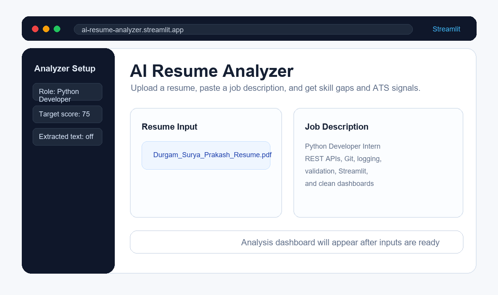

# AI Resume Analyzer


A polished Streamlit dashboard that analyzes a resume against a job description and returns a match score, skill-gap view, ATS checks, and practical improvement suggestions.



## Links

- Live demo: https://ai-resume-analyzer-4r7gp52twb247p2whw58sv.streamlit.app
- Portfolio: https://24211a6639-ops.github.io/
- Developer: https://github.com/24211a6639-ops

## Project Overview

AI Resume Analyzer compares a resume with a target job description and gives a practical dashboard for improving the resume. It highlights match score, matched skills, missing skills, semantic fit, ATS readiness, and next action steps.

## Features

- PDF and DOCX resume parsing
- Job-description keyword and skill matching
- Role-specific scoring for Python Developer, AI/ML Engineer, Data Analyst, Web Developer, and Backend Developer
- Interactive Streamlit dashboard with score cards, Plotly gauge chart, and score breakdown chart
- Matched skills and missing skills displayed as clean visual chips
- Action plan with resume improvement suggestions
- ATS readiness checklist
- Responsive custom styling with a professional color palette

## Demo Flow

1. Upload a resume in PDF or DOCX format.
2. Paste the full job description.
3. Select the target role.
4. Review the match score, skill gaps, ATS checks, and improvement tips.

## Tech Stack

| Technology | Purpose |
| --- | --- |
| Python | Core language |
| Streamlit | Web dashboard UI |
| Scikit-learn | Skill matching and scoring |
| Plotly | Interactive charts |
| PyPDF2 | PDF parsing |
| python-docx | DOCX parsing |

## Run Locally

```bash
git clone https://github.com/24211a6639-ops/ai-resume-analyzer.git
cd ai-resume-analyzer
python -m venv venv
pip install -r requirements.txt
streamlit run app.py
```

The app opens at `http://localhost:8501`.

## Project Structure

```text
app.py              Streamlit dashboard UI
matcher.py          Skill extraction, scoring, and suggestions
parser.py           PDF/DOCX text extraction
requirements.txt    Python dependencies
README.md           Project documentation
```

## Developer

Built by [24211a6639-ops](https://github.com/24211a6639-ops). See the full portfolio at https://24211a6639-ops.github.io/.

